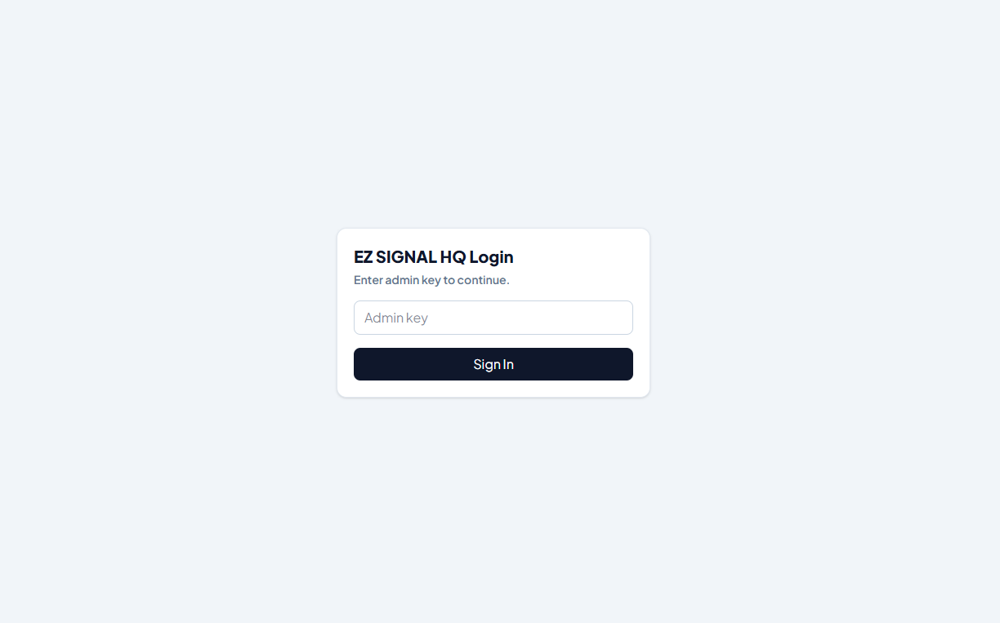

# EZ SIGNAL HQ


Central operations dashboard for the EZ SIGNAL ecosystem.



EZ SIGNAL HQ is an operational control center that unifies infrastructure management, analytics, signal workflows, deployment monitoring, and shared services across multiple EZ SIGNAL projects and brands.

It provides maintainers with a single platform to monitor production systems, manage integrations, automate operational workflows, and coordinate deployment activities across the ecosystem.

---

## Overview

EZ SIGNAL HQ serves as the operational backbone for:

* KAFRA SIGNAL
* SARJAN SIGNAL
* RICH JOKER
* SHINOBI

The platform consolidates operational visibility across infrastructure, data services, signal distribution, and deployment pipelines.

---

## Features

### Multi-Brand Operations

* Centralized brand registry
* Shared operational dashboard
* Cross-project visibility
* Unified management workflows

### Infrastructure Management

* GitHub integration
* Vercel deployment monitoring
* Supabase administration
* Telegram integration
* Access key management
* Landing page controls

### Analytics & Monitoring

* Multi-brand analytics overview
* Live shared-Supabase metrics
* Operational health monitoring
* Graceful fallback UI during database outages

### Signal Operations

* Signal ingestion workflows
* Dispatch queue management
* Runtime monitoring
* Performance controls
* Audit and tally verification

---

## Architecture

```text
GitHub
   │
Vercel
   │
EZ SIGNAL HQ
   ├── Signal Processing
   ├── Dispatch Engine
   ├── Analytics
   ├── Audit Services
   └── Monitoring
   │
Supabase
   │
Telegram
```

---

## API Endpoints

### Signal Webhooks

```http
POST /api/hq/webhooks/signal
```

Receives incoming signal and operational events.

### Dispatch Operations

```http
GET  /api/hq/dispatch/status
GET  /api/hq/dispatch/run
POST /api/hq/dispatch/run
```

Manage and execute dispatch workflows.

### Performance Management

```http
GET  /api/hq/performance
POST /api/hq/performance
```

Manage operational performance settings.

### Audit Services

```http
GET /api/hq/audit/tally
```

Retrieve tally and audit information.

---

## Operations Runbooks

| Resource                           | Path                                          |
| ---------------------------------- | --------------------------------------------- |
| Go-Live Checklist                  | `docs/VERCEL_GO_LIVE_CHECKLIST.md`            |
| TradingView Alert Templates        | `docs/HQ_TRADINGVIEW_ALERTS.md`               |
| Shared Data Migration Runbook      | `docs/SHARED_DATA_MIGRATION_RUNBOOK.md`       |
| Shared Data Migration SQL Playbook | `supabase/shared-data-migration.playbook.sql` |
| Production Smoke Testing           | `scripts/hq-prod-smoke.ps1`                   |
| Tally Verification                 | `scripts/hq-tally-check.ps1`                  |

---

## Security

Production deployments should configure:

```env
HQ_DISPATCH_RUN_TOKEN=your_token
CRON_SECRET=your_secret
```

Security controls include:

* Bearer authentication for dispatch execution
* Protected production endpoints
* Scheduled dispatch execution via Vercel Cron
* Operational audit workflows

The dispatch endpoint requires authentication in production environments.

---

## Installation

Install dependencies:

```bash
npm install
```

Run locally:

```bash
npm run dev
```

Create production build:

```bash
npm run build
```

---

## Project Goals

EZ SIGNAL HQ aims to simplify operational management for modern cloud-native projects by combining infrastructure visibility, deployment automation, monitoring, analytics, and workflow orchestration into a single maintainable platform.

---

## Contributing

Contributions, issue reports, feature requests, and documentation improvements are welcome.

Please open an issue before submitting major architectural or operational changes.

---

## License

MIT License
