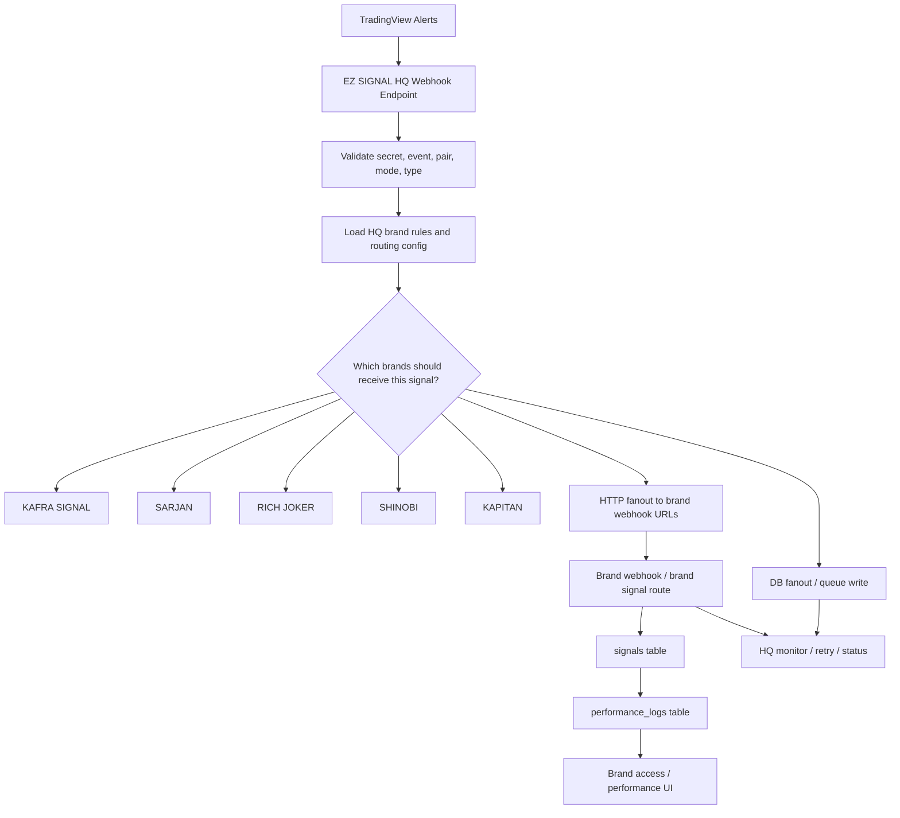

# EZ SIGNAL HQ Webhook Fanout Flow

## Flow Summary

1. TradingView sends one alert to EZ SIGNAL HQ.
2. HQ validates the payload and loads brand routing rules.
3. HQ decides which brands should receive the signal.
4. HQ fans out to the selected brands using HTTP, DB, or both.
5. Each brand stores the signal, updates live state, and later writes performance history.
6. HQ keeps the dispatch status so failed jobs can be retried.

## Practical Rule

- `signal` event starts a live signal.
- `price_update` keeps live signals moving.
- `TP1` and `TP2` remain active.
- `TP3` or `SL` ends the signal.
- `performance_logs` stores the final history.

