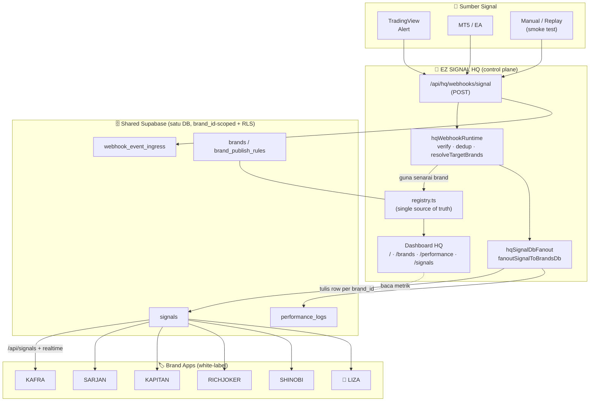
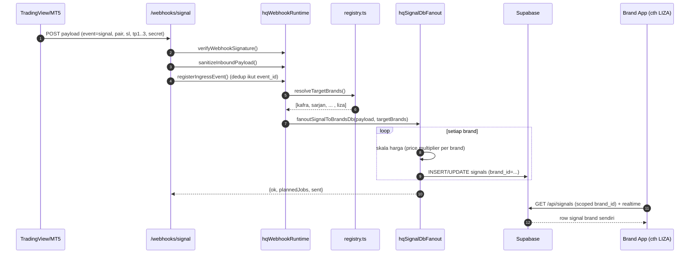
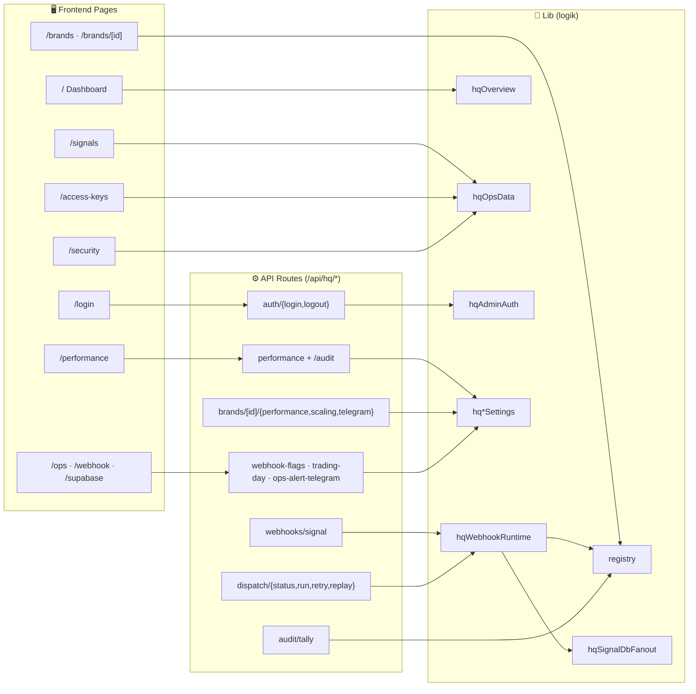
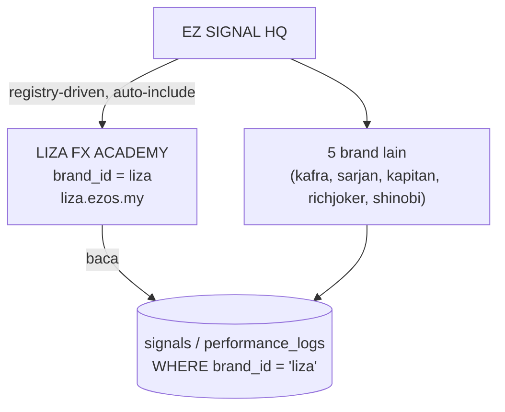
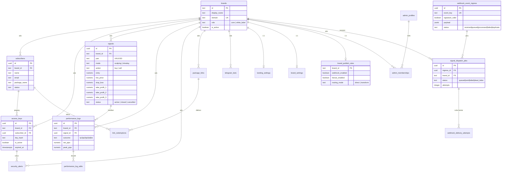
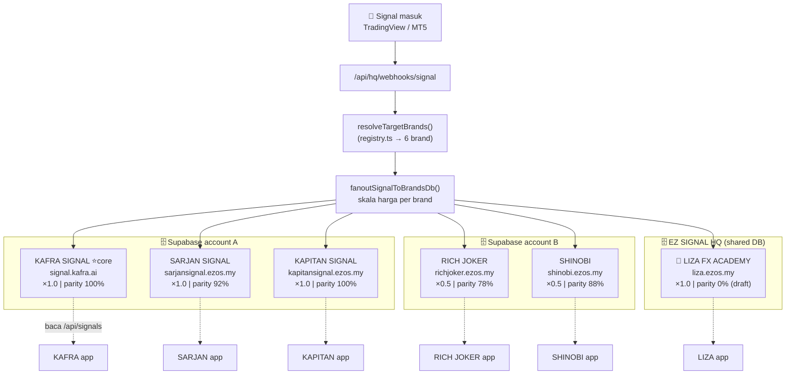

# EZ SIGNAL HQ — Architecture & Flow Diagrams

> Render: buka fail ini dalam VSCode (Markdown preview) — diagram Mermaid akan papar automatik.

---

## 1) Gambaran Besar (High-Level Architecture)

---

## 2) Aliran Signal — Langkah demi Langkah (Sequence)

---

## 3) Peta Frontend ↔ Backend ↔ Lib

---

## 4) Kedudukan LIZA dalam ekosistem

---

## 5) Struktur Database (ER Diagram — shared Supabase)

> Semua table ada `brand_id` → `brands.id` (multi-tenant, RLS scoped). Hanya hubungan utama ditunjuk.

### Kumpulan table (ikut fungsi)

| Kumpulan | Table |
|---|---|
| **Tenant / pendaftaran** | `brands`, `brand_settings`, `landing_settings`, `brand_publish_rules` |
| **Pelanggan & akses** | `subscribers`, `access_keys`, `package_links`, `link_redemptions`, `security_alerts` |
| **Signal & prestasi** | `signals`, `performance_logs`, `performance_log_edits` |
| **Webhook / dispatch** | `webhook_event_ingress`, `signal_dispatch_jobs`, `webhook_delivery_attempts` |
| **Admin & audit** | `admin_profiles`, `admin_memberships`, `audit_logs`, `telegram_bots` |

---

## 6) Semua Brand — Fan-out Detail (registry-driven)

> Satu signal masuk → HQ fan-out ke SEMUA 6 brand serentak. Setiap brand ada domain, Supabase group, accent & price-distance multiplier sendiri.

### Jadual rujukan brand (dari `registry.ts`)

| Brand | Domain | Role | Supabase Group | Price ×dist | Accent | Status / Parity |
|---|---|---|---|---|---|---|
| **KAFRA SIGNAL** | signal.kafra.ai | Core ⭐ | Account A | 1.0 | `#5eead4` | core / 100% |
| **SARJAN SIGNAL** | sarjansignal.ezos.my | White label | Account A | 1.0 | `#60a5fa` | synced / 92% |
| **KAPITAN SIGNAL** | kapitansignal.ezos.my | White label | Account A | 1.0 | `#f5c542` | synced / 100% |
| **RICH JOKER** | richjoker.ezos.my | White label | Account B | **0.5** | `#f59e0b` | watch / 78% |
| **SHINOBI** | shinobi.ezos.my | White label | Account B | **0.5** | `#d4af37` | synced / 88% |
| **LIZA FX ACADEMY** | liza.ezos.my | White label | **Shared HQ** | 1.0 | `#f9a8d4` | draft / 0% |

> **Nota price multiplier:** RICH JOKER & SHINOBI guna ×0.5 (jarak harga entry/SL/TP dikecilkan separuh) — boleh override per brand via env `HQ_BRAND_<ID>_PRICE_DISTANCE_MULTIPLIER`. Brand lain default ×1.0.
